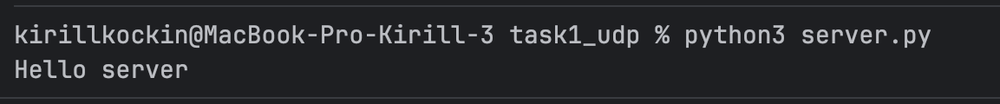
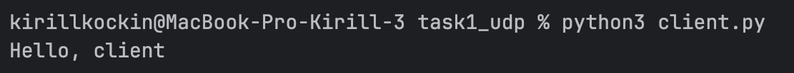
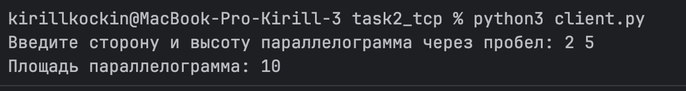
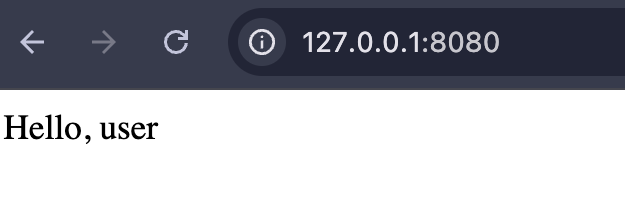
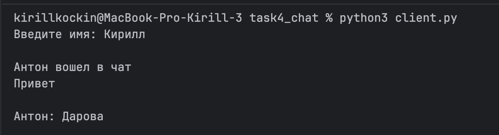
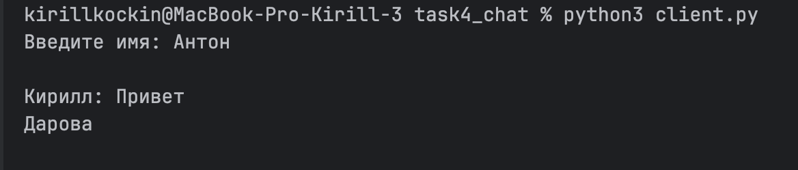
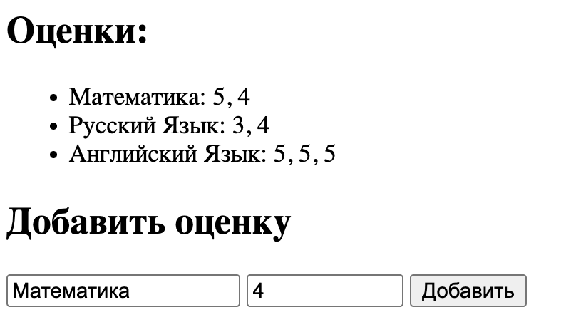
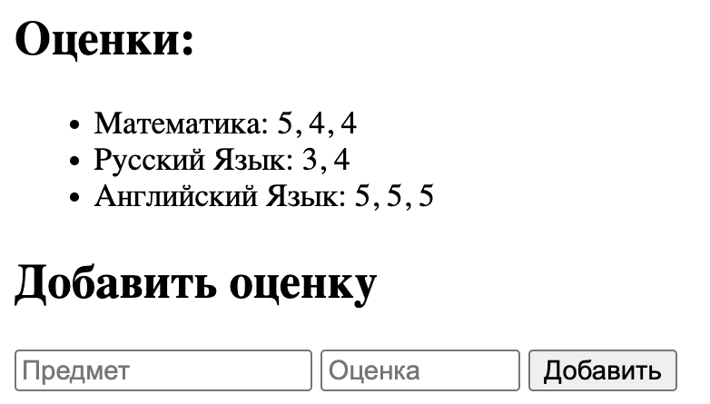

# Лабораторная работа №1

## Цель работы

Понять принципы межсокетного взаимодейсвтия в вебе. Научиться реализовывать базовую архитектуру клиент-сервер.

## Задание 1. Обмен сообщениями по UDP

### Описание

UDP (User Datagram Protocol) - это транспортный протокол без установления соединения. 
Он передаёт данные отдельными датаграммами и не гарантирует доставку, порядок получения и отсутствие потерь.

### Сервер

```python
import socket

HOST = "127.0.0.1"
PORT = 8080
server_socket = socket.socket(socket.AF_INET, socket.SOCK_DGRAM)
server_socket.bind((HOST, PORT))

data, client_address = server_socket.recvfrom(1024)
message = data.decode()
print(message)

encode_message = "Hello, client".encode()
server_socket.sendto(encode_message, client_address)

server_socket.close()
```



### Клиент
```python
import socket

HOST = "127.0.0.1"
PORT = 8080
client_socket = socket.socket(socket.AF_INET, socket.SOCK_DGRAM)
server_address = (HOST, PORT)

encode_message = 'Hello server'.encode()
client_socket.sendto(encode_message, server_address)

data, server_address = client_socket.recvfrom(1024)
message = data.decode()
print(message)

client_socket.close()
```



<!-- #################################################################################################### -->
## Задание 2. Вычисления через TCP

### Описание

TCP (Transmission Control Protocol) — транспортный протокол с установлением соединения. 
Он обеспечивает надёжную передачу данных, сохранение порядка сообщений и контроль доставки.

Площадь параллелограмма вычисляется по формуле:

**S = a × h**

### Сервер

```python
import socket

HOST = "127.0.0.1"
PORT = 8080

server_socket = socket.socket(socket.AF_INET, socket.SOCK_STREAM)
server_socket.bind(
    (HOST, PORT)
)
server_socket.listen()

while True:
    client_socket, client_address = server_socket.accept()
    data = client_socket.recv(1024)
    parameters = data.decode()

    parameters = list(map(int, parameters.split(' ')))
    result = parameters[0] * parameters[1]

    client_socket.send(str(result).encode())
    client_socket.close()
```

### Клиент
```python
import socket

HOST = "127.0.0.1"
PORT = 8080

client_socket = socket.socket(socket.AF_INET, socket.SOCK_STREAM)
client_socket.connect(
    (HOST, PORT)
)

parameters = input("Введите сторону и высоту параллелограмма через пробел: ")
client_socket.send(parameters.encode())

data = client_socket.recv(1024)
answer = data.decode()
print("Площадь параллелограмма: " + answer)

client_socket.close()
```




<!-- #################################################################################################### -->
## Задание 3. Раздача HTML-страницы по HTTP

### Описание

HTTP (HyperText Transfer Protocol) — протокол прикладного уровня, который используется для обмена данными между клиентом и сервером в вебе.

Сервер принимает TCP-соединение от клиента, получает HTTP-запрос и отправляет в ответ HTML-страницу.

Для ответа сервер формирует HTTP-заголовки:

- статус ответа `200 OK`;
- тип содержимого `text/html`;
- кодировку `utf-8`;
- длину HTML-документа через `Content-Length`.

### Сервер

```python
import socket

# 127.0.0.1:8080
HOST = "127.0.0.1"
PORT = 8080

server_socket = socket.socket(socket.AF_INET, socket.SOCK_STREAM)
server_socket.bind((HOST, PORT))
server_socket.listen()
with open("index.html", "r", encoding="utf-8") as file:
    html = file.read()
print(f"HTTP сервер запущен на {HOST}:{PORT}...")

while True:
    client_socket, client_address = server_socket.accept()
    request = client_socket.recv(1024)
    html_bytes = html.encode("utf-8")

    headers = (
        "HTTP/1.1 200 OK\r\n"
        "Content-Type: text/html; charset=utf-8\r\n"
        f"Content-Length: {len(html_bytes)}\r\n"
        "\r\n"
    )

    response = headers.encode("utf-8") + html_bytes

    client_socket.sendall(response)
    client_socket.close()
```


### HTML-страница
```html
    <!DOCTYPE html>
    <html lang="en">
    <head>
        <meta charset="UTF-8">
        <title>task number 3 web programming</title>
    </head>
    <body>
        <div>Hello, user</div>
    </body>
    </html>
```

### Результат работы

После запуска сервера HTML-страница доступна в браузере по адресу:

`http://127.0.0.1:8080`



<!-- #################################################################################################### -->
## Задание 4. Чат на сокетах

### Описание

В данной задаче реализован простой клиент-серверный чат с использованием TCP-сокетов.

Сервер принимает подключения от клиентов и обеспечивает обмен сообщениями между ними.  
TCP используется потому, что он обеспечивает надёжную передачу данных и сохранение порядка сообщений.

Для каждого подключённого клиента сервер создаёт отдельный поток, поэтому несколько пользователей могут одновременно подключаться к чату и отправлять сообщения.

### Сервер

```python
import socket
import threading

HOST = "127.0.0.1"
PORT = 8080
users = []
usernames = {}

def broadcast(message, sender_socket=None):
    for u in users:
        if u != sender_socket:
            u.sendall(message.encode())

def handle_client(client_socket):
    username = client_socket.recv(1024).decode()
    usernames[client_socket] = username

    print(f"{username} вошел в чат")
    broadcast(f"{username} вошел в чат", client_socket)

    while True:
        try:
            data = client_socket.recv(1024)

            if not data:
                break

            message = data.decode()
            print(f"{username}: {message}")
            broadcast(f"{username}: {message}", client_socket)

        except:
            break

    users.remove(client_socket)
    usernames.pop(client_socket)

    client_socket.close()

    print(username + " вышел из чата")
    broadcast(username + " вышел из чата")


server_socket = socket.socket(socket.AF_INET, socket.SOCK_STREAM)

server_socket.bind((HOST, PORT))
server_socket.listen()
print("Сервер запущен")

while True:
    client_socket, client_address = server_socket.accept()
    print("Подключился клиент:", client_address)

    users.append(client_socket)
    thread = threading.Thread(
        target=handle_client,
        args=(client_socket,)
    )

    thread.start()
```

### Клиент

```python
import socket
import threading

HOST = "127.0.0.1"
PORT = 8080

def receive_messages(client_socket):
    while True:
        try:
            data = client_socket.recv(1024)

            if not data:
                break

            print("\n" + data.decode())

        except ConnectionResetError:
            break


client_socket = socket.socket(socket.AF_INET, socket.SOCK_STREAM)
client_socket.connect((HOST, PORT))
username = input("Введите имя: ")
client_socket.sendall(username.encode())

thread = threading.Thread(
    target=receive_messages,
    args=(client_socket,),
    daemon=True
)

thread.start()

while True:
    message = input()

    if message == "exit":
        break

    client_socket.sendall(message.encode())

client_socket.close()
```






<!-- #################################################################################################### -->
## Задание 5. Простой веб-сервер (GET/POST)

### Описание

В данной задаче реализован HTTP-сервер для работы с журналом оценок.

Сервер обрабатывает два типа HTTP-запросов:
- `GET` — возвращает HTML-страницу со списком дисциплин и оценок.
- `POST` — получает название дисциплины и оценку из HTML-формы и добавляет её в журнал.

HTTP-запрос разбирается вручную. Из первой строки запроса сервер определяет используемый HTTP-метод, путь и версию протокола.

Например вот это:

```text
GET / HTTP/1.1
```

превращается в вот это:

```python
method = "GET"
path = "/"
version = "HTTP/1.1"
```

Моковые данные:

```python
evaluations = {
    "Математика": [5, 4],
    "Русский Язык": [3, 4],
    "Английский Язык": [5, 5, 5]
}
```

### Сервер

```python
import socket
from mock import evaluations

# 127.0.0.1:8080
HOST = "127.0.0.1"
PORT = 8080

server_socket = socket.socket(socket.AF_INET, socket.SOCK_STREAM)
server_socket.bind((HOST, PORT))
server_socket.listen()
print(f"HTTP сервер запущен на {HOST}:{PORT}...")

while True:
    client_socket, client_address = server_socket.accept()
    request = client_socket.recv(1024).decode("utf-8")
    print(request)

    first_line = request.split("\r\n")[0]
    method, path, version = first_line.split()

    if method == "GET":
        eval_html = "<ul>"

        for subject, grades in evaluations.items():
            eval_html += f"<li>{subject}: {', '.join(map(str, grades))}</li>"

        eval_html += "</ul>"

        html = f"""
        <html>
        <head>
            <meta charset="UTF-8">
            <title>Журнал с оценками</title>
        </head>
        <body>
            <h2>Оценки:</h2>
            {eval_html}
            <h2>Добавить оценку</h2>

            <form method="POST" action="/" enctype="text/plain">
                <input type="text" name="subject" placeholder="Предмет">
                <input style="width: 100px;" type="number" name="grade" min="1" max="5" placeholder="Оценка">
                <button type="submit">Добавить</button>
            </form>
        </body>
        </html>
        """

        html_bytes = html.encode("utf-8")

        headers = (
            "HTTP/1.1 200 OK\r\n"
            "Content-Type: text/html; charset=utf-8\r\n"
            f"Content-Length: {len(html_bytes)}\r\n"
            "\r\n"
        )

        response = headers.encode("utf-8") + html_bytes

        client_socket.sendall(response)

    elif method == "POST":
        body = request.split("\r\n\r\n")[1]

        lines = body.strip().split("\r\n")

        subject = lines[0].split("=")[1]
        grade = int(lines[1].split("=")[1])

        if subject not in evaluations:
            evaluations[subject] = []

        evaluations[subject].append(grade)
        response = (
            "HTTP/1.1 303 See Other\r\n"
            "Location: /\r\n"
            "Content-Length: 0\r\n"
            "\r\n"
        )

        client_socket.sendall(response.encode("utf-8"))

    client_socket.close()
```

### Результат работы

При открытии страницы браузер отправляет `GET`-запрос. Сервер формирует HTML-страницу и выводит все дисциплины и соответствующие им оценки.

При заполнении формы браузер отправляет `POST`-запрос с названием дисциплины и оценкой. Если дисциплина уже существует, оценка добавляется в её список. Если дисциплины ещё нет, для неё создаётся новый список оценок.

После обработки `POST` сервер возвращает ответ `303 See Other`, после чего браузер снова переходит на главную страницу и отображает обновлённый журнал.

До добавления:


После:

